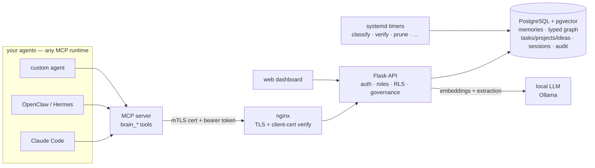
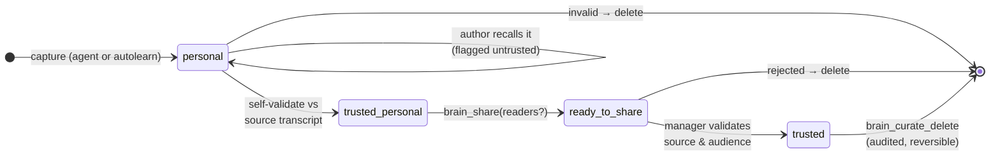
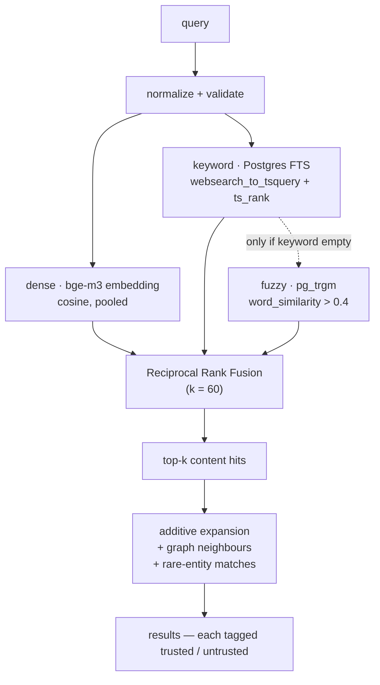
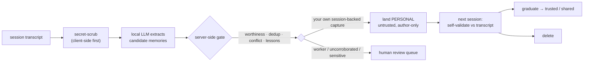

<div align="center">

# fleetmem

**Self-hosted, governed long-term memory for a _fleet_ of AI agents.**
_Not a per-dev notepad — a shared, access-controlled brain your whole agent roster plugs into._

[](https://github.com/aurelius86/fleetmem/actions/workflows/ci.yml)
[](LICENSE)
[](CHANGELOG.md)
[](https://modelcontextprotocol.io)
[](#install)
[](#security-model)

```
   ┌──────────────────────────────────────────────────────────────┐
   │  agents  ─▸  MCP  ─▸  mTLS + token  ─▸  governed memory store  │
   │            hybrid recall · typed graph · earned trust          │
   └──────────────────────────────────────────────────────────────┘
```

[**Why**](#why-this-exists) ·
[**Quickstart**](#quickstart) ·
[**How it works**](#how-it-works) ·
[**Concepts**](#core-concepts) ·
[**Deep dives**](#under-the-hood) ·
[**Security**](#security-model) ·
[**FAQ**](#faq)

</div>

---

fleetmem is an open, self-hosted **memory and knowledge-graph server** for *teams* of AI agents. Agents
store facts, decisions, and lessons over **MCP**; fleetmem indexes them by meaning (hybrid vector +
keyword search), links them into a **typed knowledge graph** (`supersedes` / `conflicts_with` /
`depends_on` / …), and **governs who sees what** (per-agent mTLS + roles, and a
`personal → shared → trusted` trust lifecycle). Point any number of agents — on any framework — at one
access-controlled brain.

It runs entirely on **your own hardware**, and ships with **no memory and no credentials**: an empty
brain that mints its own security material on first run.

## Why this exists

LLM agents forget everything between sessions. Bolting on a vector store gives you *search* but not
*governance* — no identity, no access control, no sense of which memory supersedes which. That breaks
the moment you run **more than one agent**:

| The problem with a flat store | What fleetmem does |
|---|---|
| **Whose memory is this?** No author — you can't tell a verified fact from a small model's hallucination. | Every write is **attributed** to an authenticated agent. |
| **Who's allowed to read it?** One shared pool = your ops bot reads what your personal assistant wrote. | Every read is filtered by **role, reader-groups, and a sensitivity ceiling**. |
| **Which fact is current?** Notes contradict over time; similarity search happily returns the stale one. | A **typed graph** (`supersedes` / `conflicts_with`) keeps knowledge coherent. |
| **How does it stay clean?** No dedup, linking, or retention — the store rots. | **Self-running maintenance**: classify, verify, dedup, re-embed, prune. |
| **Can I trust what a local model "learned"?** | **Trust is earned** — captures land untrusted and are validated against their source transcript before anything relies on them. |

Compared with a plain vector store (pgvector, Qdrant, Chroma) or a hosted memory API — those give you
similarity search. **fleetmem adds identity, access control, a typed graph, a validation lifecycle, and
the maintenance that keeps a store from rotting — on your hardware.**

## Quickstart

**Requirements:** PostgreSQL 15+ with `pgvector`, Python 3.11+, `openssl`, nginx, and a local LLM
endpoint (Ollama or compatible) for embeddings + extraction. Install is systemd + venv. *(Docker
packaging is planned, not yet shipped.)*

The fastest path is to **point your LLM agent at [`AGENTS.md`](AGENTS.md)** — a runbook written for an
agent to execute end-to-end. Manually:

```bash
cp brain.env.example brain.env      # set your DB + Ollama endpoints
sudo ./install.sh                   # Postgres + pgvector, migrations, PKI, systemd + nginx
./fleetmem-bootstrap-manager.py       # your first manager — you pick the name; prints cert + token ONCE
./smoke_test.sh                     # verifies the front door, mTLS, and a real recall
```

Then [`INSTALL.md`](INSTALL.md) connects an agent and [`ENROLL.md`](ENROLL.md) adds more. Upgrades are
one command (`./update.sh`) and preserve your data, config, and PKI.

Once the MCP is wired, your agent just calls tools:

```python
brain_remember(
  name="pg_upgrade_gotcha",
  body="Upgrading Postgres in place needs pgvector rebuilt, or recall silently "
       "returns zero rows. See [[deploy_runbook|depends_on]].",
  mtype="reference", tags=["postgres", "gotcha"],
)
# → saved: personal, usable immediately by you, invisible to everyone else.

brain_recall("why did recall return nothing after the db upgrade", k=5)
# → your note, plus what it links to, plus anything sharing a rare entity
#   ("pgvector") with the query — each tagged trusted / untrusted.

brain_share(id)      # → into the review queue; a manager graduates it to trusted
brain_propose(...)   # → skip personal, straight to review
```

A manager approves it, it becomes `trusted`, and **every other agent you run** can recall it — subject
to reader groups and its sensitivity ceiling.

## Connect an agent

Bringing the server up is half the job — the other half is **wiring an agent to it and getting the
agent to actually _use_ it**. Three steps:

**1 · Enroll → mint an identity.** Run the enrollment flow ([`ENROLL.md`](ENROLL.md)) to issue the
agent a client cert + a one-time token, then point the one per-agent file, `~/.fleetmem/client.conf`, at
where you placed them:

```sh
BRAIN_URL=https://YOUR-BRAIN-HOST:8443
BRAIN_CERT=~/.fleetmem/pki/client.crt
BRAIN_KEY=~/.fleetmem/pki/client.key
BRAIN_CA=~/.fleetmem/pki/ca.crt
BRAIN_TOKEN_FILE=~/.fleetmem/<name>.token
```

**2 · Register the MCP server → the agent gets the tools.** Point your agent at `mcp/server.py` over
MCP (stdio), passing the same `BRAIN_*` values as env. For **Claude Code** that's an `.mcp.json` entry
— any MCP-capable runtime (Cursor, Cline, a custom loop) takes the same shape:

```json
{
  "mcpServers": {
    "fleetmem": {
      "command": "python3",
      "args": ["/path/to/fleetmem/mcp/server.py"],
      "env": {
        "BRAIN_URL": "https://YOUR-BRAIN-HOST:8443",
        "BRAIN_CERT": "/home/you/.fleetmem/pki/client.crt",
        "BRAIN_KEY":  "/home/you/.fleetmem/pki/client.key",
        "BRAIN_CA":   "/home/you/.fleetmem/pki/ca.crt",
        "BRAIN_TOKEN_FILE": "/home/you/.fleetmem/<name>.token"
      }
    }
  }
}
```

Restart the agent and `brain_recall`, `brain_remember`, … are live. (Add `"BRAIN_MODE": "worker"` to
lock an agent to the governed worker toolset.)

**3 · Register the SessionStart hook → the agent actually _uses_ the brain.** Having the tools is not
the same as using them: an LLM will forget to recall unless something reminds it, every run. The
shipped `fleetmem-session-start.sh` hook injects a **per-agent brief at the top of every session** — its
habits (recall-before-you-act, remember-on-confirm, share-via-review, never author == validator) plus
its own open tasks, unread inbox, and pending reviews. For **Claude Code**:

```json
{ "hooks": { "SessionStart": [ { "hooks": [
  { "type": "command", "command": "/path/to/fleetmem/fleetmem-session-start.sh" } ] } ] } }
```

For other runtimes: run the script at session start and prepend its stdout to the system context. It
always exits 0 (never fails a session) and prints a static fallback if the brain is unreachable, so a
cold start is never blind.

> **This step is the difference between "installed" and "used."** The MCP makes the tools *available*;
> the injected brief makes the agent reach for them **every session** — turning fleetmem from a store it
> _can_ call into the memory it _does_ call. Verify the agent's identity end-to-end with the `/whoami`
> smoke-test in [`INSTALL.md`](INSTALL.md); [`AGENTS.md`](AGENTS.md) is the same setup written for an
> agent to execute for you.

## What you get

| | |
|---|---|
| 🧠 **Memory server over MCP** | 60+ tools, no client library. Managers see the full set; workers a governed subset. |
| 🔎 **Hybrid retrieval** | Dense + keyword fused with RRF, graph + rare-entity expansion, typo-tolerant — returns *how notes connect*. |
| 🔐 **Governance** | Per-agent mTLS identity, reader groups, a sensitivity ceiling, and a human review queue. |
| 🕸️ **Typed knowledge graph** | `supersedes` / `conflicts_with` / `depends_on` … — vocabulary is config, not code. |
| 🌱 **Autolearn** | Memories extracted from your sessions, secret-scrubbed and gated — never auto-trusted. |
| 📋 **More than notes** | Tasks, projects (with living plans), ideas, skills, sessions/transcripts, agent-to-agent messages, an infra model, an audit log. |
| 🖥️ **Web dashboard** | Graph explorer, approval queues, config, skills, per-agent session-brief preview. |
| ⚙️ **Self-running maintenance** | Eight systemd timers: edge-classify, verify, dedup, re-embed, retention, validation sweep… |

## How it works



Every arrow into the API is authenticated (client cert **and** token); every read is filtered by
Postgres Row-Level Security (role, reader groups, sensitivity ceiling). The local LLM handles
embeddings and session-end extraction — **no data leaves your box** unless you opt into a cloud backend
(and even then, sensitive content is routed away from it).

## Core concepts

### Memories
A named note with a body, a `description`, an author, a type (`reference`, `feedback`, `project`,
`decision`, …), tags, and a sensitivity level. Written with `brain_remember` (personal) or
`brain_propose` (straight to the shared review queue).

### The trust lifecycle — `personal → ready_to_share → trusted`
Capture is **never blocked**: anything an agent learns lands immediately as its **own personal,
untrusted** note that only it can recall. Trust is earned *later*, and always against a **source**.



| State | Who can read it | Meaning |
|---|---|---|
| `personal` | the author only | captured, not yet validated |
| `ready_to_share` | author + managers | proposed for sharing, in the review queue |
| `trusted` | per reader groups + sensitivity ceiling | validated and shared |

Recall tells an agent when a note is untrusted and hands back the **source session**, so the agent
checks it against the transcript, then `brain_validate_memory`s it — or deletes it. **Author ≠
validator** at every step, and cross-agent sharing always needs a manager. The effect: **no agent
silently inherits another agent's mistake**, and a human is always the terminal authority.

### The typed knowledge graph
Notes link with typed edges — `relates_to`, `supersedes`, `conflicts_with`, `depends_on`, `runs_on`,
`accessed_via`, `uses` — from three places:

1. **Hand-typed** at write time — `[[target|rel_type]]` in a note body (`[[target]]` = `relates_to`).
2. **Co-use links** — new notes auto-link to their nearest semantic neighbours.
3. **A precision-first classifier job** (below) that types the rest with a local LLM.

The vocabulary lives in [`graph.yaml`](graph.yaml), **not in code** — add your domain's types
(`invoiced_to` / `archived_in`) with a config edit and the classifier picks them up.

### Identity and access
Every agent is a row with a **role** (`manager` / `worker` / `readonly`), a **lane**, a **sensitivity
ceiling**, and **reader groups**. Two factors are required on every call: an **mTLS client certificate**
(CN = the agent's name) **and** a **bearer token** (only its hash is stored). Visibility is a `see_all`
**capability** (not merely "manager"): everyone without it respects `readers` — which holds *both* group
and agent-name tokens, so a note can be scoped to a subset (`readers=['a','b']` is invisible to a third
manager). Row-Level Security in Postgres is the floor beneath the app's own checks.

### It isn't only memories
The same governed store also holds **tasks**, **projects** (each with a living-plan document),
**ideas**, **skills**, **sessions** (ingested transcripts, searchable), **messages** between agents, an
**infra model**, and an **audit log**.

## Under the hood

<details>
<summary><b>Hybrid retrieval — how a recall is actually assembled</b></summary>

<br/>



- **Every arm shares one access filter** (`mem_read_where`) — dense, keyword, fuzzy, *and* the 1-hop
  graph expansion (re-checked on both endpoints). No path returns a row the caller may not see; no
  cross-brain personal leak.
- **Fusion:** RRF over dense + keyword; fuzzy trigram fallback only fires when keyword is empty
  (catches typos / out-of-vocabulary terms). Modes returned: `hybrid` · `keyword_only` · `+fuzzy`
  (composable).
- **Expansion is additive** — it can only *append* neighbours (scored by cross-session co-recall +
  typed-edge weight; `supersedes`/`conflicts_with` surface strongest), **never** reorder or drop a
  content hit.
- **Honest under strain:** the dense arm runs inside a `SAVEPOINT` — if the embedder is down it rolls
  back that arm and degrades to `keyword_only` *loudly* (a `recall_degraded` audit event + a `degraded`
  flag), never aborting the transaction or silently returning weaker results.
- **No LLM in `/recall`** — deliberate; the only synthesis path is `/deep-search`, which reuses the
  same core so all access control still applies.
- **Two optional refinements, off by default** (base hybrid is already at ceiling for a curated brain):
  on-demand LLM **re-ranking** (`rank=true`, fail-safes to original order on timeout) and span-level
  **body compression** (~85% smaller injected context; full body always fetchable via `brain_get`).

</details>

<details>
<summary><b>Autolearn — capture → scrub → gate → land (never auto-trusted)</b></summary>

<br/>



At session end a transcript is handed to fleetmem, which extracts durable candidates, **scrubs secrets
client-side first**, runs a worthiness judge, checks duplicates + conflicts, and consults a **lessons**
table so it never re-learns something you already rejected. What survives lands as **personal /
untrusted** — autolearn *never* writes a trusted or shared memory.

**Content-blind global dedup (v2):** before landing, a **privileged, content-blind** read compares the
new candidate's *embedding* (a numeric fingerprint — never the note body) against **all** rows. If a
*peer* already holds the same fact, fleetmem fires a reviewed **share request** instead of creating a
duplicate, and links the new note into the graph across agents. The drafting LLM only ever sees the
author's own chat. Every step is configurable, and the whole pipeline can be turned off.

</details>

<details>
<summary><b>Typed-edge classifier — a precision-first 3-gate pipeline</b></summary>

<br/>

An off-hot-path batch job types the still-untyped edges with a local LLM. A relation is promoted only
if it survives **all three** gates — otherwise it stays `relates_to` (single-pass typing over-promotes
~97%, so abstention is the default):

1. **Abstention** — the model marks a relation `specific` only if the source text states one.
2. **Constrained** — the label is enum-restricted to your ontology at decode time (a JSON-schema
   guarantee, not a prompt suggestion).
3. **Grounding** — the model must return a verbatim `supporting_quote`; promotion is **rejected** unless
   that quote is a literal substring of the note (kills name-guessing and direction errors).

Idempotent and resumable; uncertain types go to a review queue rather than being guessed into the graph.

</details>

<details>
<summary><b>Enrollment — add an agent or a manager at runtime, n-of-m approved</b></summary>

<br/>

Adding a body is a **runtime flow — no code change**:

1. **Apply** (open, cert-exempt): the new body generates a key + CSR and POSTs `/enroll` with a
   proposed name, purpose, and requested role. It gets a one-time secret that grants **nothing** yet.
2. **Approve** (K distinct managers): managers vote via `brain_enroll_approve`; approval lands only when
   `approvers ≥ ENROLL_APPROVALS` (a live knob; default 2, set 1 for a solo box). Any manager reject
   blocks. The approver assigns the role — **including `manager`**, which is how you add managers through
   the same flow.
3. **Token + cert:** the applicant polls for its one-time token; a manager signs the CSR with
   `sign-agent-cert.sh` — **off** the API, against the box's own local CA.

The API process holds **no** CA or signing power: a fully-compromised API still cannot mint or alter a
certificate.

</details>

<details>
<summary><b>Session-start injection — auto-teach each agent at boot</b></summary>

<br/>

A shipped `SessionStart` hook calls `/session-brief` and assembles a brief **for the specific
authenticated agent** (bound to its cert — each agent gets different content, not a shared template),
in three layers:

1. **Static core** (role-aware) — habits + a tiny tool cheat-sheet (recall-before-act, remember-on-
   confirm, share via review queue, never author == validator); managers also get queue reminders.
2. **Live state** (RLS-filtered) — this agent's open/in-progress tasks, unread inbox, and (managers)
   pending-review counts.
3. **Overlay** — a global house-rules block plus a per-agent overlay.

Falls back gracefully (to `/bootstrap` on older brains, then a static file when the brain is
unreachable), and is token-capped.

</details>

<details>
<summary><b>Shipping it — the fail-closed export &amp; scrub</b></summary>

<br/>

fleetmem is packaged by an export tool that copies only an **allowlist** into a clean tree, rewrites any
environment-specific tokens, and then runs a **hard, fail-closed scrub-verify**: it scans every shipped
file for private IPs, hostnames, key material, secret references, and internal identifiers. **Any hit
aborts the build.** The published artifact is therefore a strict, certified-clean subset of the source —
this repo is the proof, not a promise.

</details>

## Security model

- **Two factors, always.** mTLS client cert + bearer token on every call except open enrollment.
- **The box mints its own CA.** `fleetmem-init-pki.sh` (plain openssl) creates a local CA + server cert at
  install. No external/cloud PKI, and **no key material ships** in this repo.
- **Signing stays off the network service.** Agent CSRs are signed out-of-band, so compromising the API
  can never mint certs.
- **Defence in depth.** Application checks are backed by Postgres Row-Level Security; the app role is
  privilege-scoped (no `DELETE` on tables it never hard-deletes).
- **Tokens are hashed.** Plaintext is shown once at enrollment, never stored.
- **Enrollment is n-of-m.** You choose how many managers must co-approve a new agent.
- **Sensitivity routing.** Content marked sensitive/secret never leaves the box for a cloud model,
  whatever the cloud setting says — `test_pick_backend.py` ships as a proof you can run.

Reporting a vulnerability: see [`SECURITY.md`](SECURITY.md).

## Configuration

Two layers:

- **`brain.env`** — connection-level settings read at boot: `PGDATABASE`, `OLLAMA_EMBED_URL`,
  `EMBED_MODEL`, `OLLAMA_GEN_URL`, `EXTRACT_MODEL`, `RERANK_MODEL`.
- **The live config table** — ~21 tunables you read/change at runtime via `GET`/`PATCH /config` or the
  dashboard's Config tab, **no restart**:

| Knob | What it controls |
|---|---|
| `RECALL_K`, `RECALL_POOL`, `RELATED_CAP` | recall breadth and how much graph context returns |
| `ENTITY_EXPAND_WEIGHT`, `ENTITY_EXPAND_HUBCAP` | rare-entity expansion strength; hub-entity cutoff |
| `AUTOLEARN_LLM_JUDGE`, `AUTOLEARN_DEDUP_COSINE`, `AUTOLEARN_LINK_CAP` | autolearn gating + linking |
| `AUTOLEARN_LAND_SENSITIVE`, `AUTOLEARN_LAND_QUARANTINED` | where autolearn output lands |
| `RECALL_SPAN_COMPRESS`, `RECALL_SPAN_COUNT`, `RECALL_SPAN_MIN_CHARS` | span compression (off by default) |
| `PROVISIONAL_TTL_DAYS`, `VALIDATE_SWEEP_DELETE` | lifecycle + the retention backstop |
| `ENROLL_APPROVALS` | how many managers must approve a new agent |
| `ENTITY_IP_PREFIXES` | optional site subnets to treat as entities (unset by default) |

The relation vocabulary lives in [`graph.yaml`](graph.yaml); the embedding model is pinned in
`model-pin.json` so a silent model swap is detectable.

## Interfaces

- **MCP — 60+ tools.** Recall/search (`brain_recall`, `brain_deep_search`, `brain_search_transcripts`,
  `brain_get`, `brain_skill_recall`), writing/governance (`brain_remember`, `brain_propose`,
  `brain_share`, `brain_validate_memory`, `brain_curate_delete`, `brain_get_session_turns`), work
  tracking (`brain_tasks`, `brain_add_task`, `brain_projects`, `brain_add_project`, `brain_ideas`),
  plus attachments, tags, infra, and agent messaging (`brain_send`, `brain_inbox`). Full reference:
  [`USAGE.md`](USAGE.md).
- **HTTP — ~89 endpoints** for everything the MCP exposes plus operator surfaces (`/healthz`,
  `/whoami`, `/bootstrap`, `/config`, `/jobs`, `/agents`, `/graph`, `/audit`, `/needs-you`,
  `/session/ingest`, `/session/search`). `/healthz` reports the running version.
- **Dashboard** — the web UI under `dashboard/`.

## Where fleetmem fits

fleetmem is **not** an agent framework — it's the shared **memory layer** they plug into. Runtimes like
**OpenClaw** and **Hermes** *run* agents (chat channels, tool execution, one agent's own memory);
fleetmem is a **standalone, shared, governed memory server** that any number of agents — on any framework
— point at over MCP. Keep your runtime; add fleetmem so all your agents read and write **one
access-controlled long-term brain**. *They run the agents; fleetmem is the shared brain you give them.*

## FAQ

**Does any data leave my machine?** No. Embeddings and extraction run against your local LLM endpoint.
A cloud extraction backend is *optional* and sensitivity-routed — sensitive/secret content never routes
to it.

**Do I need Claude / a specific model?** No. Any MCP-capable agent works; the local LLM is
Ollama-or-compatible; the embedding model is your choice (pinned for reproducibility).

**Does it ship with your data?** No. The database starts empty and the box mints its own CA + tokens on
first run.

**Can I run one agent?** Yes — governance stays out of the way (a single manager self-approves). The
multi-agent machinery matters when you add a second.

**What if the graph types are wrong for my domain?** Edit `graph.yaml` — types are config, not code, and
a discovery script proposes an ontology from your own notes.

**Is it production-ready?** It's `v0.1.x` and runs a real daily workload, but the API may still change
between minor versions. Read [`CHANGELOG.md`](CHANGELOG.md) before upgrading.

## Documentation map

| Doc | What's in it |
|---|---|
| [`AGENTS.md`](AGENTS.md) | agent-executable setup runbook (the quickest install) |
| [`INSTALL.md`](INSTALL.md) | manual install + connecting an agent |
| [`ENROLL.md`](ENROLL.md) | adding more agents; the n-of-m approval flow |
| [`USAGE.md`](USAGE.md) | day-to-day manual: every MCP tool, the memory model, a worked walkthrough |
| [`SECURITY.md`](SECURITY.md) | security model and vulnerability reporting |
| [`UPGRADING.md`](UPGRADING.md) | what's preserved, one-command update, rollback |
| [`CHANGELOG.md`](CHANGELOG.md) | release notes |
| [`SCHEMA-SCAFFOLD-NOTES.md`](SCHEMA-SCAFFOLD-NOTES.md) | schema scaffolding and dead-column guide |
| [`CONTRIBUTING.md`](CONTRIBUTING.md) | how to contribute (inbound = AGPL) |

## Status

`v0.1.6`. The engine, governance, graph, autolearn, and dashboard are in daily use. Known gaps: Docker
packaging isn't shipped (systemd + venv only), and there's no built-in HA/failover — a single Postgres
instance, so back it up.

## License

**GNU AGPL-3.0** — see [`LICENSE`](LICENSE). You may run and modify fleetmem freely (including privately);
if you distribute it or run a modified version as a network service, you must share your source under the
AGPL. Founded and maintained by **Aurelius** (see [`NOTICE`](NOTICE) / [`AUTHORS`](AUTHORS));
contributions welcome under [`CONTRIBUTING.md`](CONTRIBUTING.md).
