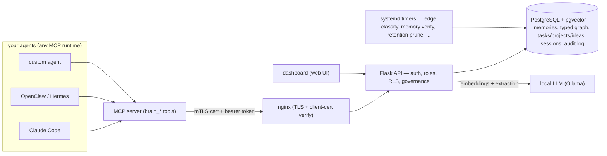

# fleetmem

[](https://github.com/aurelius86/fleetmem/actions/workflows/ci.yml)
[](LICENSE)
[](CHANGELOG.md)
[](https://modelcontextprotocol.io)

**Self-hosted, governed long-term memory for your AI agents.**

fleetmem is an open, self-hosted memory and knowledge-graph server for *teams* of AI agents. Agents
store facts, decisions, and lessons; fleetmem indexes them by meaning (hybrid vector + keyword search),
links them into a **typed knowledge graph** (`supersedes` / `conflicts_with` / `depends_on` / …), and
**governs who sees what** (per-agent mTLS + roles; a `personal → shared → trusted` lifecycle). Connect
any LLM agent over **MCP** and it gains durable, shared, access-controlled memory.

It runs entirely on your own hardware. It ships with **no memory and no credentials** — an empty
brain that mints its own security material on first run.

---

## Contents

- [Why](#why) · [What you get](#what-you-get) · [Core concepts](#core-concepts)
- [What it looks like](#what-it-looks-like) · [Features](#features) · [Architecture](#architecture)
- [Security model](#security-model) · [Install](#install) · [Configuration](#configuration)
- [Interfaces](#interfaces) · [Where fleetmem fits](#where-fleetmem-fits) · [FAQ](#faq)
- [Documentation map](#documentation-map) · [Status](#status) · [License](#license)

---

## Why

LLM agents forget everything between sessions. Bolting on a vector store gives you search but not
*governance* — no identity, no access control, and no sense of which memory supersedes which. That
breaks down the moment you have more than one agent:

- **Whose memory is this?** A flat store has no author, so you can't tell a verified fact from
  something a small local model hallucinated last Tuesday.
- **Who's allowed to read it?** One shared pool means your ops bot can read anything your personal
  assistant wrote.
- **Which fact is current?** Notes contradict each other over time, and plain similarity search
  happily returns the stale one.
- **How does it stay clean?** Without dedup, linking, and retention, the store rots.

fleetmem is the **governed layer**: every write is attributed to an authenticated agent, every read is
filtered by role and sensitivity, and a typed graph keeps knowledge coherent as it grows.

## What you get

- A **memory server** your agents talk to over MCP — 60+ tools, no client library needed
  (a manager sees the full set; workers see a governed subset).
- **Hybrid retrieval** that returns *how notes connect*, not just what matched — with optional
  on-demand LLM re-ranking and span-level body compression.
- **Governance**: per-agent identity, reader groups, a sensitivity ceiling, and a review queue.
- **Autolearn**: memories extracted from your sessions automatically, then gated.
- **More than notes**: tasks, projects, ideas, skills, sessions/transcripts, and agent-to-agent messages.
- **A web dashboard** for the graph, approvals, config, skills, and per-agent settings.
- **Maintenance that runs itself**: edge classification, verification, retention, re-embedding.

## Core concepts

### Memories
A memory is a named note with a body, a `description`, an author, a type (`reference`, `feedback`,
`project`, `decision`, …), tags, and a sensitivity level. Agents write them with `brain_remember`
(personal) or `brain_propose` (straight to the shared review queue).

### The lifecycle: `personal → ready_to_share → trusted`
Capture is **never blocked** — anything an agent learns lands immediately as its **own personal,
untrusted** note that only it can recall. Trust is earned *later*:

| State | Who can read it | Meaning |
|---|---|---|
| `personal` | the author only | captured, not yet validated |
| `ready_to_share` | author + managers | proposed for sharing, in the review queue |
| `trusted` | per reader groups + sensitivity ceiling | validated and shared |

Recall tells an agent when a note is untrusted and hands back the **source session**, so the agent can
check it against the transcript and then `brain_validate_memory` it — or delete it. Sharing across
agents always needs a manager. The effect: **no agent silently inherits another agent's mistake.**

### The typed knowledge graph
Notes link to each other with typed edges — `relates_to`, `supersedes`, `conflicts_with`,
`depends_on`, `runs_on`, `accessed_via`, `uses`. Edges come from three places:

1. **Hand-typed** at write time — put `[[target|rel_type]]` in a note body (`[[target]]` = `relates_to`).
2. **Co-use links** — new notes auto-link to their nearest semantic neighbours.
3. **A classifier job** that types untyped edges with a local LLM, precision-first: a relation is only
   promoted if it survives all gates, otherwise it stays `relates_to`. Uncertain types go to a review
   queue rather than being guessed into the graph.

The vocabulary lives in `graph.yaml`, not in code — add your domain's types (e.g.
`invoiced_to` / `archived_in`) with a config edit and the classifier picks them up.

### Identity and access
Every agent is a row in the `agent` table with a **role** (`manager` / `worker` / `readonly`), a
**lane**, a **sensitivity ceiling**, and **reader groups**. Two factors are required on every call:
an **mTLS client certificate** (CN = the agent's name) *and* a **bearer token** (only its hash is
stored). Row-Level Security in Postgres is the backstop under the application's own checks.

### It isn't only memories
The same governed store also holds **tasks**, **projects** (each with a living plan document),
**ideas**, **sessions** (ingested transcripts, searchable), **messages** between agents, an
**infra model**, and an **audit log**.

## What it looks like

Once the MCP is wired, your agent just calls tools:

```
brain_remember(
  name="pg_upgrade_gotcha",
  body="Upgrading Postgres in place needs the pgvector extension rebuilt, "
       "or recall silently returns zero rows. See [[deploy_runbook|depends_on]].",
  mtype="reference", tags=["postgres","gotcha"]
)
→ saved: personal, usable immediately by you, invisible to everyone else.

brain_recall("why did recall return nothing after the db upgrade", k=5)
→ your note, plus the notes it links to, plus anything sharing a rare entity
  ("pgvector") with the query — each tagged trusted / untrusted.

brain_share(id)        → sends it to the review queue
brain_propose(...)     → skips personal, straight to review
```

Nothing here is bespoke: a manager approves it, it becomes `trusted`, and *every other agent you run*
can now recall it — subject to reader groups and its sensitivity ceiling.

## Features

### Hybrid retrieval
Dense vectors (via a local embedding model) and keyword search (Postgres full-text) are fused with
**Reciprocal Rank Fusion**, then expanded two ways:

- **Graph expansion** — pull in what the hits link to, so you see relationships, not isolated matches.
- **Entity expansion** — pull in notes sharing a *rare* entity with the query (task ids, hostnames,
  filenames), weighted by rarity; hub entities are skipped so common terms don't spray noise.

A trigram index catches typos and out-of-vocabulary terms that exact-token search misses.

Two optional refinements, both **off by default** (base hybrid recall is already at ceiling for a
well-curated brain):

- **On-demand re-ranking** — pass `rank=true` to `brain_recall` and the content hits are reordered by
  the local LLM before returning; it **fail-safes to the original order** on any timeout, so recall
  never stalls.
- **Span-level compression** (`RECALL_SPAN_COMPRESS`) — trims each recalled body to its most
  query-relevant spans (cheap lexical scoring, no extra embed calls; the first span is always kept),
  ~85% smaller bodies on long notes for thinner injected context. The full body is always fetchable
  via `brain_get`.

**Recall stays honest under strain:** a transient embedder blip is ridden out with a bounded
backoff-retry, and if the dense arm does stay down the degradation is *surfaced* (a `recall_degraded`
audit event + a `degraded` field on the response) instead of silently returning weaker results.

### Skills
Reusable how-to notes ("skills") are a first-class corpus: agents fetch them with `brain_skill_recall`
/ `brain_skill_get`, and the dashboard's **Skills** tab lists, filters, and opens them.

### Autolearn
At session end, a transcript can be handed to fleetmem, which extracts durable candidate memories,
scrubs secrets **client-side first**, runs a worthiness judge, checks for duplicates and conflicts,
consults a **lessons** table (so it never re-learns something you already rejected), and lands what
survives as personal/untrusted notes. Every step is configurable, and the whole thing can be turned off.

### Sessions and transcripts
Transcripts are ingested (redacted), indexed for full-text and vector search, and become the
**source of truth** an agent validates its own memories against. `rebuild_session.py` can re-derive
memories and edges from a transcript after the fact.

### Governance and review
A `/needs-you` queue surfaces **only** what genuinely needs a human — share requests and escalations —
rather than every note. Managers approve, deny, or escalate. A manager may not graduate its *own*
note (author ≠ validator). For retiring a stale *trusted* note there's a sanctioned, audited
manager delete (`brain_curate_delete`, reason required, reversible soft-delete) — no raw SQL needed.

### Dashboard
A small web UI ships under `dashboard/`: the knowledge graph, the approval queues, a memory explorer,
a System tab (jobs, session rebuild), a Config tab, and an Agents tab with a per-agent
**session-start injection preview** — exactly what a given agent will be told at boot.

### Maintenance that runs itself
Eight systemd timers ship: edge classification, infra-edge derivation, queue drain, golden-set recall
eval, memory verification, re-embedding, retention pruning, and the validation sweep. All are
schedulable and runnable on demand from the dashboard.

### Sensitivity routing
Extraction backends are pluggable and **routed by sensitivity**: content marked sensitive or secret
never leaves your box for a cloud model, whatever the cloud setting says. `test_pick_backend.py`
ships as a standalone proof you can run yourself.

## Architecture



Every arrow into the API is authenticated (client cert **and** token); every read is filtered by
row-level security (role, reader groups, sensitivity ceiling). The local LLM handles embeddings and
session-end extraction.

## Security model

- **Two factors, always.** mTLS client cert + bearer token on every call except open enrollment.
- **The box mints its own CA.** `fleetmem-init-pki.sh` (plain openssl) creates a local CA and server
  cert at install. No external or cloud PKI, and **no key material ships** in this repo.
- **Signing stays off the network service.** `sign-agent-cert.sh` signs agent CSRs out-of-band, so
  compromising the API can never mint certs.
- **Defence in depth.** Application checks are backed by Postgres Row-Level Security; the app role's
  privileges are scoped (no `DELETE` on tables the app never hard-deletes).
- **Tokens are hashed.** Plaintext is shown once at enrollment and never stored.
- **Enrollment is n-of-m.** You choose how many managers must co-approve a new agent.

Reporting a vulnerability: see [`SECURITY.md`](SECURITY.md).

## Install

**Requirements:** PostgreSQL 15+ with `pgvector`, Python 3.11+, `openssl`, nginx, and a local LLM
endpoint (Ollama or compatible) for embeddings and extraction. Install is systemd + venv; Docker
packaging is planned but does **not** ship yet.

The fastest path is to **point your LLM agent at [`AGENTS.md`](AGENTS.md)** — it's a runbook written
for an agent to execute: bring up the server, create your first (genesis) manager, wire the MCP.

Manually:

```bash
cp brain.env.example brain.env     # set your DB + Ollama endpoints
sudo ./install.sh                  # Postgres + pgvector, migrations, PKI, systemd + nginx
./fleetmem-bootstrap-manager.py      # your first manager: you pick the name; prints cert + token ONCE
./smoke_test.sh                    # verifies the front door, mTLS, and a real recall
```

Then follow [`INSTALL.md`](INSTALL.md) to connect an agent, and [`ENROLL.md`](ENROLL.md) to add more.
Upgrades are one command (`./update.sh`) and preserve your data, config, and PKI — see
[`UPGRADING.md`](UPGRADING.md).

## Configuration

Two layers:

- **`brain.env`** — connection-level settings, read at boot: `PGDATABASE`, `OLLAMA_EMBED_URL`,
  `EMBED_MODEL`, `OLLAMA_GEN_URL`, `EXTRACT_MODEL`, `RERANK_MODEL`.
- **The live config table** — ~21 tunables you can read and change at runtime via `GET`/`PATCH
  /config` or the dashboard's Config tab, with no restart. Highlights:

| Knob | What it controls |
|---|---|
| `RECALL_K`, `RECALL_POOL`, `RELATED_CAP` | recall breadth and how much graph context comes back |
| `ENTITY_EXPAND_WEIGHT`, `ENTITY_EXPAND_HUBCAP` | entity-expansion strength; hub-entity cutoff |
| `AUTOLEARN_LLM_JUDGE`, `AUTOLEARN_DEDUP_COSINE`, `AUTOLEARN_LINK_CAP` | autolearn gating and linking |
| `AUTOLEARN_LAND_SENSITIVE`, `AUTOLEARN_LAND_QUARANTINED` | where autolearn output lands |
| `RECALL_SPAN_COMPRESS`, `RECALL_SPAN_COUNT`, `RECALL_SPAN_MIN_CHARS` | span-level body compression on recall (off by default) |
| `PROVISIONAL_TTL_DAYS`, `VALIDATE_SWEEP_DELETE` | lifecycle and the retention backstop |
| `ENROLL_APPROVALS` | how many managers must approve a new agent |
| `ENTITY_IP_PREFIXES` | optional site subnets to treat as entities (unset by default) |

The relation vocabulary lives in [`graph.yaml`](graph.yaml); the embedding model is pinned in
`model-pin.json` so a silent model swap is detectable.

## Interfaces

- **MCP — 60+ tools** (a manager sees the full set; workers see a governed subset). Recall and search
  (`brain_recall`, `brain_deep_search`, `brain_search_transcripts`, `brain_get`, `brain_schema`,
  `brain_docs_recall`, `brain_skill_recall`, `brain_skill_get`); writing and governance
  (`brain_remember`, `brain_propose`, `brain_share`, `brain_validate_memory`, `brain_curate_delete`,
  `brain_my_provisional`, `brain_get_session_turns`); work tracking (`brain_tasks`,
  `brain_add_task`, `brain_update_task`, `brain_projects`, `brain_add_project`, `brain_ideas`,
  `brain_add_idea`); attachments, tags, infra, and agent-to-agent messaging (`brain_send`,
  `brain_inbox`). Full reference with worked examples: [`USAGE.md`](USAGE.md).
- **HTTP — ~89 endpoints** for everything the MCP exposes plus operator surfaces (`/healthz`,
  `/whoami`, `/bootstrap`, `/config`, `/jobs`, `/agents`, `/graph`, `/audit`, `/needs-you`,
  `/session/ingest`, `/session/search`, …). `/healthz` reports the running version.
- **Dashboard** — the web UI under `dashboard/`.

## Where fleetmem fits

fleetmem is **not** an agent framework — it's the shared **memory layer** they plug into. Runtimes like
**OpenClaw** and **Hermes Agent** *run* agents (chat channels, tool execution, one agent's own
memory); fleetmem is a **standalone, shared, governed memory server** that any number of agents — on any
framework — point at over MCP. Keep your runtime; add fleetmem so all your agents read and write **one
access-controlled long-term brain**. In short: *they run the agents; fleetmem is the shared brain you
give them.*

Compared with a plain vector store (pgvector, Qdrant, Chroma) or a hosted memory API: those give you
similarity search. fleetmem adds identity, access control, a typed graph, a validation lifecycle, and
the maintenance jobs that keep a store from rotting — and it runs on your hardware.

## FAQ

**Does any data leave my machine?**
No. Embeddings and extraction run against your local LLM endpoint. A cloud extraction backend is
*optional* and sensitivity-routed — sensitive/secret content never routes to it.

**Do I need Claude / a specific model?**
No. Any MCP-capable agent works. The local LLM is Ollama-or-compatible; the embedding model is your
choice (pinned for reproducibility).

**Does it ship with your data?**
No. The database starts empty and the box mints its own CA and tokens on first run.

**Can I run one agent?**
Yes — governance stays out of your way (a single manager self-approves). The multi-agent machinery
matters when you add a second.

**What if the graph types are wrong for my domain?**
Edit `graph.yaml`. Types are config, not code, and there's a discovery script that proposes an
ontology from your own notes.

**Is it production-ready?**
It's `v0.1.x` and runs a real daily workload, but the API may still change between minor versions.
Read [`CHANGELOG.md`](CHANGELOG.md) before upgrading.

## Documentation map

| Doc | What's in it |
|---|---|
| [`AGENTS.md`](AGENTS.md) | agent-executable setup runbook (the quickest install) |
| [`INSTALL.md`](INSTALL.md) | manual install + connecting an agent |
| [`ENROLL.md`](ENROLL.md) | adding more agents; the n-of-m approval flow |
| [`USAGE.md`](USAGE.md) | day-to-day manual: every MCP tool, the memory model, a worked walkthrough |
| [`SECURITY.md`](SECURITY.md) | security model and vulnerability reporting |
| [`UPGRADING.md`](UPGRADING.md) | what's preserved, one-command update, rollback |
| [`CHANGELOG.md`](CHANGELOG.md) | release notes |
| [`SCHEMA-SCAFFOLD-NOTES.md`](SCHEMA-SCAFFOLD-NOTES.md) | schema scaffolding and dead-column guide |
| [`CONTRIBUTING.md`](CONTRIBUTING.md) | how to contribute (inbound = AGPL) |

## Status

`v0.1.6`. The engine, governance, graph, autolearn, and dashboard are in daily use. Known gaps:
Docker packaging isn't shipped (systemd + venv only), and there's no built-in HA/failover — a single
Postgres instance, so back it up.

## License

**GNU AGPL-3.0** — see [`LICENSE`](LICENSE). You may run and modify fleetmem freely (including
privately); if you distribute it or run a modified version as a network service, you must share your
source under the AGPL. Founded and maintained by **Aurelius** (see [`NOTICE`](NOTICE) /
[`AUTHORS`](AUTHORS)); contributions welcome under [`CONTRIBUTING.md`](CONTRIBUTING.md).
</content>
</invoke>
